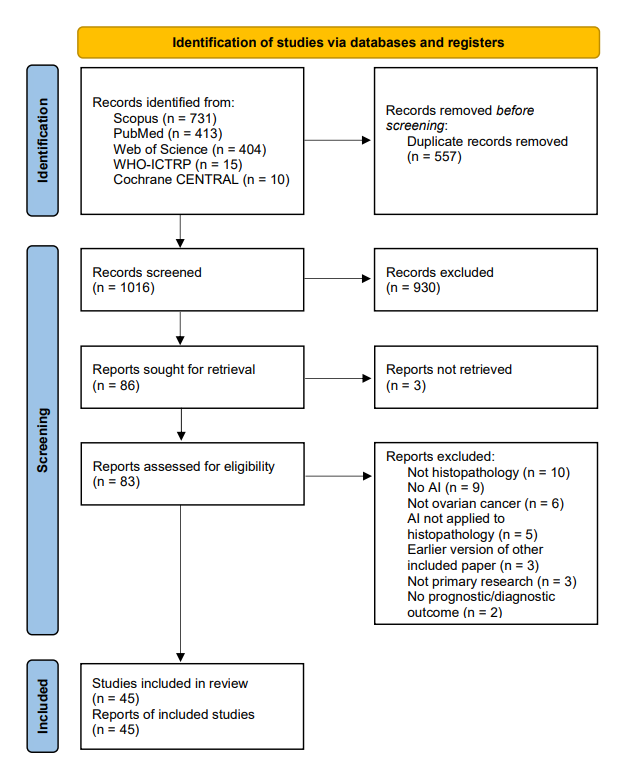

# Artificial Intelligence in Ovarian Cancer Histopathology: A Systematic Review 

[Prospero Protocol](https://www.crd.york.ac.uk/prospero/display_record.php?ID=CRD42022334730) | [Arxiv Preprint](https://arxiv.org/abs/2303.18005)

DataExtractionTemplate.xlsx is the form used for data extraction in the review. 

This review follows [PRISMA 2020 reporting guidelines](https://www.bmj.com/content/372/bmj.n71) and uses [PROBAST](https://pubmed.ncbi.nlm.nih.gov/30596875/) to assess the risk of bias of included research.
